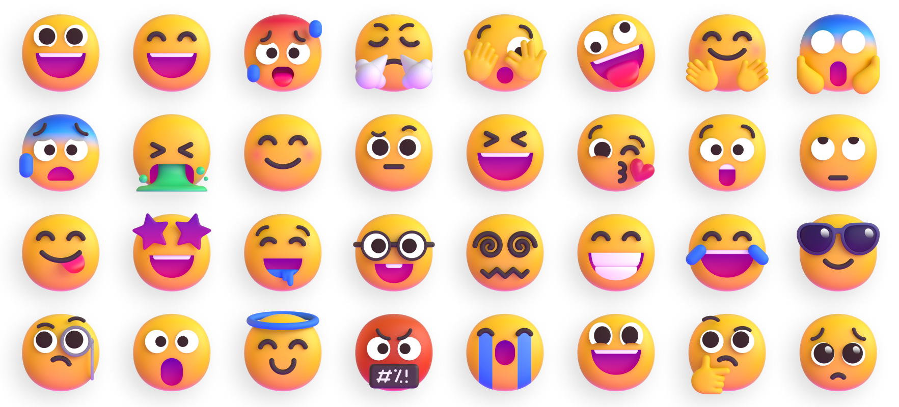

# Fluent Emoji

Fluent Emoji are a collection of familiar, friendly, and modern emoji from Microsoft. This repo converts those emojis into React components for you to use in your projects.

# Following below data is from the original repo : [microsoft/fluentui-emoji](https://github.com/microsoft/fluentui-emoji) | [Official Website](https://fluentemoji.com/)
## Contact

Please feel free to [open a GitHub issue](https://github.com/microsoft/fluentui-emoji/issues/new) and assign to the following points of contact with questions or requests.

- Jason Custer([@jasoncuster](https://github.com/jasoncuster)) / Spencer Nelson([@spencer-nelson](https://github.com/spencer-nelson)) - Design

## Code of Conduct

This project has adopted the [Microsoft Open Source Code of Conduct](https://opensource.microsoft.com/codeofconduct). For more information see the [Code of Conduct FAQ](https://opensource.microsoft.com/codeofconduct/faq/) or contact opencode@microsoft.com with any additional questions or comments.
